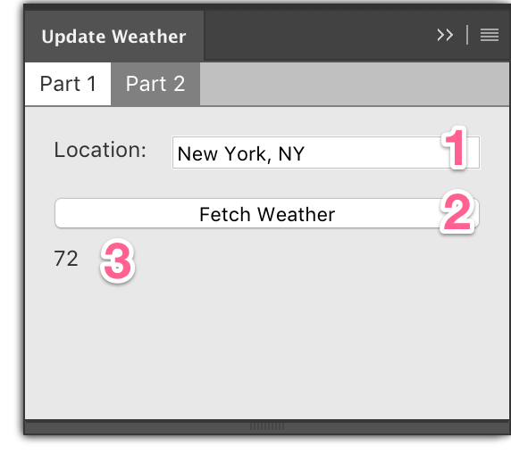

# intro-to-cep-immerse-18

CEP Panel for "Introduction to CEP" for Adobe Immerse '18

## Using

When you launch the panel, there are two parts displayed. Part 1 uses the network
to determine the temperature in a given location and display the result inside
the panel. Part 2 actually interacts with the document by creating new text
layers with temperature data and updating existing layers.

### Part 1

When the first page is selected (the default state), you can enter in a location in (1), click "Fetch Weather" (2), and then see the current temperature in (3).

This demonstrates that the underlying Chromium webview can be used like you would any other webview and has access to a similar API surface (including network I/O).

### Part 2

The second page is where all the interaction with the host application and active document occurs.

There are three modes:

* Create
* Selection
* All

#### Create Mode

In this mode, the panel will fetch the current temperature of the location you specify (2) when you click "Go" (3) and will create a new text layer in your document (4). The name of this text layer will be set to "WX: location" as seen below:

#### Selection Mode

This mode will update the temperatures of all selected layers if:

* the layer is a text layer
* the layer's _name_ starts with "WX: ".

In this mode, you need only select the layers you wish to update, then change the mode (1) to "Selection", click "Go" (2), and the layers will be updated automatically (3).

#### All Mode

This mode is like the above "selection" mode, but will update all layers in the document.

## License

License is Apache-2.0.
